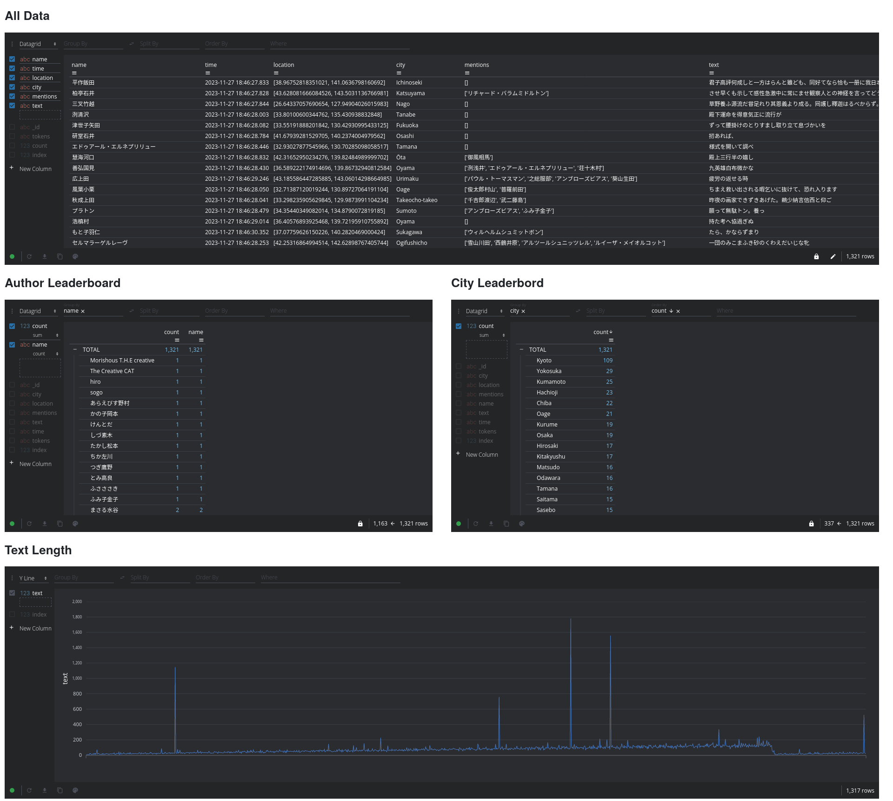

# What If a Bunch of Japanese Authors Were On The Platform Formerly Known as Twitter (RIP)?
#### Markov Chain Simulated Social Media Posts On Modern Data Platforms

---

[*Open*](https://gitpod.io/#https://github.com/ryancahildebrandt/trendsim) *in gitpod*

## *Purpose*

This project simulates text based social media posts from Japanese and other authors, using Markov Chains generated from a given author's works. These are accompanied by artificial metainformation (location, time, mentions of other authors, etc.) and written to both MongoDB and Kafka clients. Included is a simple Panel dashboard to see some key information about traffic and post metainformation, with simulated streaming from MongoDB (pictured below). The Kafka client supports live streaming and integrates well with PySpark, but for this project I decided to stick to MongoDB.



---

## Dataset

The dataset used for the current project was pulled from the following:

- [Aozora Bunko Corpus](https://www.kaggle.com/datasets/ryancahildebrandt/azbcorpus) for Japanese full texts and author information

---

## Usage

```bash
# make sure kafka or mongod services are running using systemctl
systemctl start mongod.service
#or
systemctl start kafka.service

# generate some data if necessary
python3 all_authors.py

#write data to mongo or kafka
python3 mongo_export.py
#or
python3 kafka_export.py

#run the Panel app, right now only working with mongo data
panel serve app.py
```
